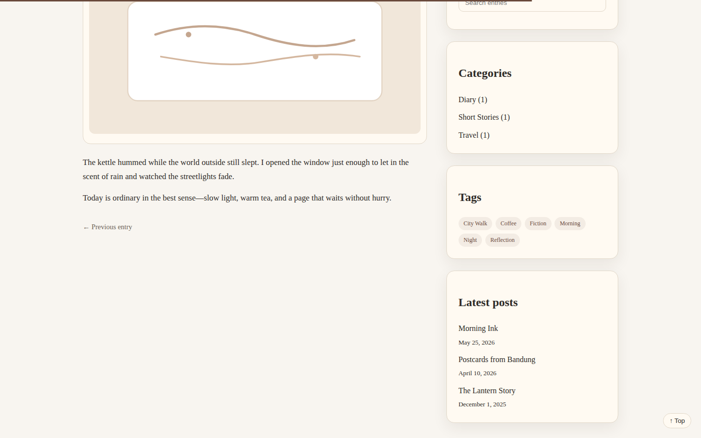

# catatan-arumuki

## Deploy to GitHub Pages

This repository uses GitHub Actions to build and deploy Astro to GitHub Pages.

1. Open **Settings → Pages** in this repository.
2. Set **Source** to **GitHub Actions**.
3. Push to the default branch (or run the workflow manually).

Expected URL: https://couldbearumuki.github.io/catatan-arumuki/

## New UX additions

- Post pages now show **estimated reading time**.
- Post pages include a lightweight **reading progress bar** at the top.
- Post pages include a **Back to Top** button that appears while scrolling.

## Screenshot

